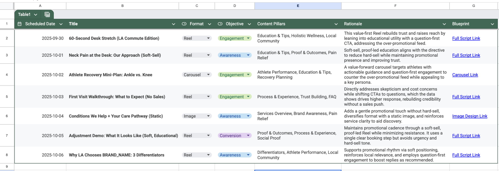

+++
title = "What Top Chiropractors Do Differently on Instagram"
description = "Three data-backed shifts that help chiropractors build trust, promote services, and keep engagement high."
date = 2025-09-30
draft = false
template = "article.html"

[taxonomies]
tags = ["social media", "marketing", "chiropractic", "mixplate"]

[extra]
toc = false
+++

So I'm building a Marketing AI, and I spend a lot of time analyzing what separates successful brands on social media from those who struggle to see results.

A commenter on a previous post asked me to look into chiropractors, so I got curious.

I pointed my analysis engine at some of the top-performing chiropractor accounts on Instagram to see if I could identify any data-backed trends or best practices specific to your niche. The results were pretty interesting and I wanted to share them online!

<!-- more -->

## 1. Personal branding dominates over practice-based / organisational accounts.

90% of all posts across top performers in the niche feature the practitioner's face—they were on camera demonstrating an exercise, explaining a concept or working with a patient.

What this means for you is if your social media marketing is from the perspective of your organisational brand, then you really should consider rebranding into a personal brand.

## 2. A surprising discovery for this niche: a higher promotional frequency works, but only if you do it right.

One of the most interesting findings was that top accounts post promotional content far more often than the typical "2 promotional posts for every 8 non-promotional posts" rule you hear everywhere. The data showed an essentially opposite mix of 8 promotional or practice-related posts for every 2 purely educational/non-promotional posts was the best practice for this niche.

However, there's a crucial catch: the vast majority of these "promos" are soft-sells. They avoid aggressive, hard-sell phrases like "Book Now!" Instead, they focus on demonstrating value, showing patient results (with consent), and educating the audience on the benefits of their care. This builds credibility and lets the results do the selling.

## 3. Engagement Questions are the best CTA for this niche

For CTAs a clear winner emerged. Direct commands like "Book now", "DM me now", were around 50% LESS effective in terms of overall engagement compared to engagement questions like ("What do you guys think about X?", "Comment your experience with Y", "Who here is suffering from Z, tell me your story", etc.)

For this spefific niche this type of CTA does much better, so keep that in mind when crafting your captions or scripts.

## Post frequency and hashtags

Posting frequency: Aim for 10 posts a week. Yes 10. If you have trouble, just record something, ANYTHING, with your face on the camera, and post it. It works. Do it. Idk how many times I've had to say this.

For this niche have 4-5 relevant hashtags per post.

## Sample content plan

Obviously it's not easy turning strategy into action, so the AI I'm building is designed to turn these strategic insights into a concrete, day-by-day action plan.

For example, based on this analysis, it generated a sample campaign plan that automatically schedules a mix of "value" and "soft-sell" posts, suggests specific question-based CTAs, and ensures the chiropractor is the star of the show.

I hope these data-backed insights are helpful! I'm just a founder trying to see if this kind of analysis is actually valuable to real business owners.

If you're a small business owner and you're curious to see what the data says about your own account, or need help to get a proper campaign plan going with step-by-step blueprints for post ideas, DM me your handle or send me a message.